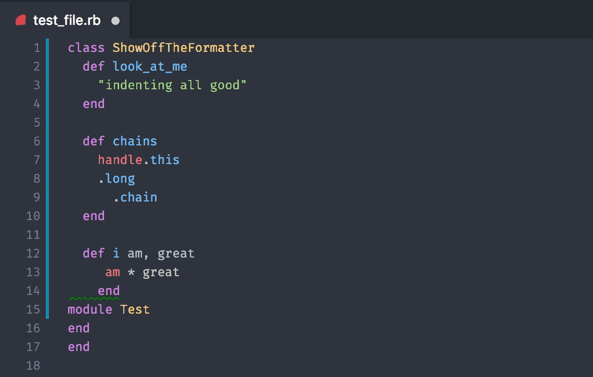

# vscode-rufo

VS Code extension for formatting ruby files using the [rufo](https://github.com/ruby-formatter/rufo) gem.



## Features

- Supports formatting on save
- Or with a command

## Requirements

Depends on the [rufo](https://github.com/ruby-formatter/rufo) gem being installed and available in your PATH.

```bash
  $ gem install rufo
```

## Usage

If you want to format a file one off, you will find `Format ruby file` in your command palette.

If you want to have `rufo` format your files every time you save, add this setting your User / Workspace settings:

* `rufo.formatOnSave`: enable/disable formatting the entire Ruby document on save. (default: **false**)


## Issues

Doesn't seem to respect `.rufo` preferences, not sure why yet.
